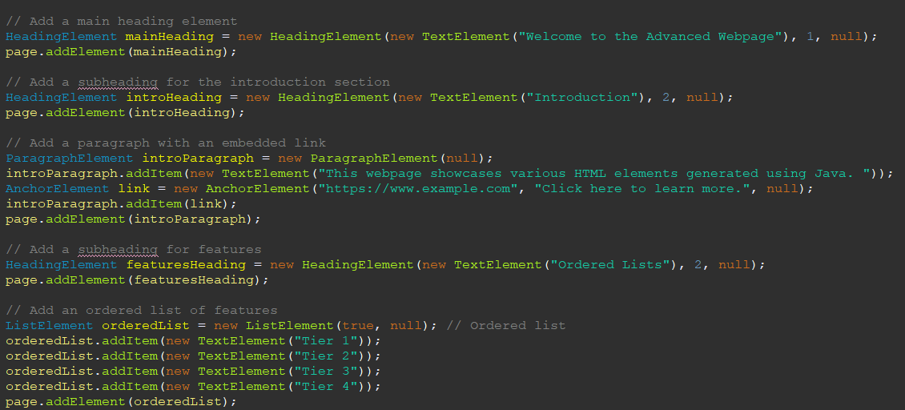

# HTML Generator
 Generates HTML through Java Code and Methods, making it more readable
# Instructions 
1. To install the generator, clone the repository and upload it to an IDE like Ecplise. If you are using Eclipse, select File > Import > Existing Projects into Workspace > Select root directory. Then browse to the cloned repository and upload. In the IDE Create a new class in the src folder where to create the main method.
2. In the main method create the webpage object, then create element objects that correspond to the tags you would want in html, calling the intended methods to customize the information within this element.  
   
